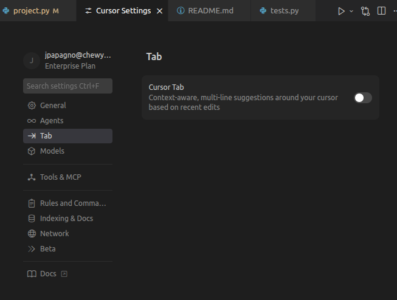

welcome to the course

feel free to install pycharm and do find the real lesson's materials in there.
Not necessary, as the projects are in this repo that will be good to do otherwise.

I spent time creating this (AI helped obv) but its good and I expect you to take time to do it as well. It should help you become more confident with coding, by not only learning some basic -> intermedate technicies but also with the time this will take. More time practicing, failing, etc -> the more you will learn and the more your confidence will grow. Like anything else, this will be challenging at times.

course link:
https://www.udemy.com/course/100-days-of-code/

RULES:

use git for everything. I expect each project to be checked up to your repo. use git add, git commit -m, and git push to cleanly add code to a repo of your own. Use a new branch per day and have it PR reviewed by another python course member.

before each project in this repo, do the assigned lectures on Udemy. I would say the lectures are optional if you prefer to just do the project for that day.

However, do NOT use AI. Google's auto ai search is fine but NO ChatGPT and NO Cursor.

DISABLE AUTOCOMPLETE. autocomplete or the Cursor chat window will do these projects instantly and you will learn nothing. I did not spend time creating this for AI to complete these projects for you. I expect you to do it yourself completely (or ask a human/google for help :)

Open Cursor Settings (Ctrl + Shift + J)

Go to 'Tab'

Disable Cursor Tab

If you think a lesson is too easy for you, great. Do it anyways. The more time you have coding without AI, the more your confidence will grow. If it is way too easy, we can talk about it and maybe that one isn't right for this course. I am trying to build the ship as it sails as they (Thomas) say, so I will be adjusting it as it goes.

These projects will greatly increase your python abilities, and are in a similar style to LeetCode, which is the standard for technicial interviews if you ever need that in the future.

When you implement a fuction in the projects, run the test file in the terminal or just by hiting the run button 
(its an arrow on the top right that says 'run python file' when you hover over it)

The tests will either pass or fail and based on why it failed, this will give you a clue to what you did wrong. Note: these tests were AI generated so may not be accurate to every edge case.

lectures notes for me:
- day 1-5: loops, functions, lists, if/else, strings, dicts, etc.
Useful for getting into python, functional programming, datatypes etc.  
- day 6- large logic project: maybe .
- day 7- OOD classes, fields. creating robot class
- day 8- onkey, turtle game. maybe 
- day 9- snake game: maybe 
- day 10- read write from files
- day 11- getting data from csv
- day 12- parsing strings into list stuff, dicts etc. maybe . 
- day 13- GUI, maybe 
- Exceptions and Error handling day 14
- Debugging day 15
- learning + using API's day 16
- day 17: git stuff.  and do from the beginning
- day 18: BFS grid project. 
- day 19: full robot OOD project w/ grid, waypoints, robots, etc.
- day 20: capstone. choose between better robot sim or data tool.
Change into the full data project that liv wants? Multi input -> ABC classes -> multioutput (hugging face, csv)
